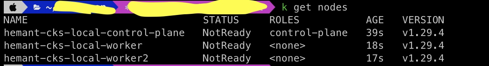

# Local Multi Node Kubernetes Playground with Kind
   This repository holds files to create local multi node kubernetes cluster using [kind](https://kind.sigs.k8s.io/docs/user/quick-start/) with CNI plugin [Calico](https://docs.tigera.io/calico/latest/about/)

## Pre-requisities

### 1- Docker or any CRI installed
### 2- Download and install kind, [installation guide](https://kind.sigs.k8s.io/docs/user/quick-start/#installing-with-a-package-manager)
### 3- Modify config.yaml file as per requirement, I have disabled default CNI from kind as I need calico (This is optional) 
more details about configuration [here](https://kind.sigs.k8s.io/docs/user/configuration/)


## Create Local cluster

### 1- create kind cluster

```
kind create cluster --name hemant-cks-local --image "kindest/node:v1.29.4" --config values.yaml
```

### 2- Check status of nodes

```
kubectl get nodes
```


### 3- Install Calico
```
kubectl apply -f https://raw.githubusercontent.com/projectcalico/calico/v3.28.0/manifests/calico.yaml
```

### 4- Verify Calico installation
```
kubectl get pods -l k8s-app=calico-node -A
```
